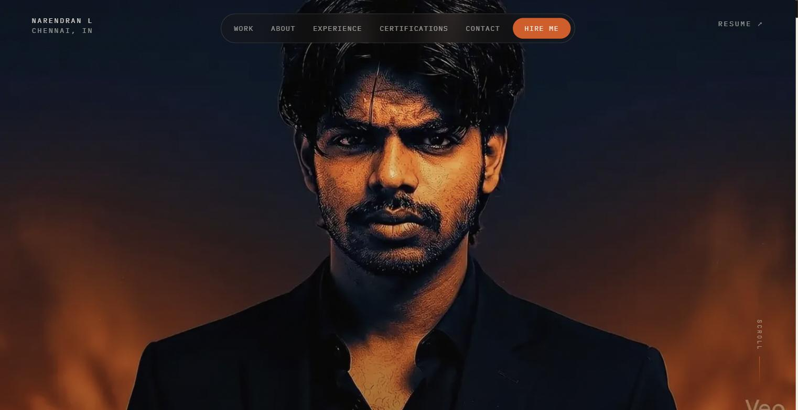
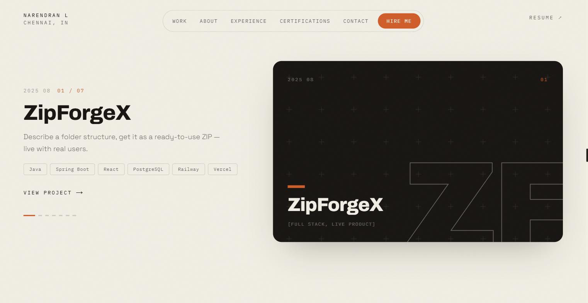
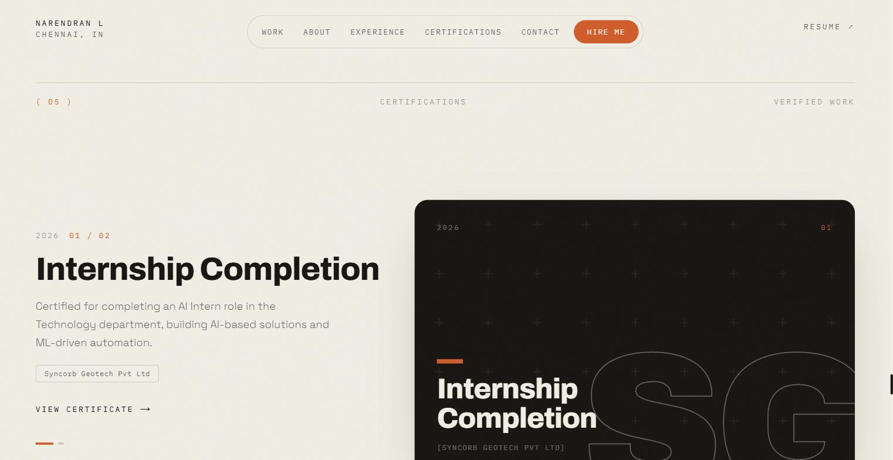

# Narendran L — Portfolio

**[→ narendranl-portfolio.vercel.app](https://narendranl-portfolio.vercel.app/)**

A scroll-driven, editorial-style personal portfolio — built with Next.js 14 and
a canvas video hero, not a template. If a screenshot catches your eye, the
live site has a lot more going on (smooth-scroll, pinned showcases, a reticle
cursor) that a static image can't show.

<p align="center">
  
</p>

<table>
  <tr>
    <td width="50%"></td>
    <td width="50%"></td>
  </tr>
  <tr>
    <td align="center"><sub>Alche-style pinned project showcase</sub></td>
    <td align="center"><sub>Certifications, in the same visual language</sub></td>
  </tr>
</table>

<p align="center">
  
  
  
  
</p>

## Highlights

- **Scroll-driven video hero** — 120 WebP frames drawn to a `<canvas>` and scrubbed
  by scroll position over a 700vh pin, with a cream editorial preloader.
- **Alche-style pinned showcases** — scroll flips through featured work, and
  separately through certifications, one piece at a time. Each has a full
  archive/detail-page system behind it (`/works/[slug]`, `/certificates/[slug]`).
- **15 real projects**, each with a designed, palette-locked cover (no
  screenshots) generated deterministically per project.
- **Certifications section** — internship and hackathon certificates, shown
  with the same designed-cover treatment as projects, each opening its own
  detail page with a link to the source PDF.
- Smooth scrolling via [Lenis](https://github.com/darkroomengineering/lenis),
  scroll-reveal animations, a self-inverting reticle cursor, and a
  floating island navbar that swaps light/dark based on scroll position.

## Tech stack

- **Framework:** Next.js 14 (App Router), TypeScript, React 18
- **Motion:** Framer Motion, Lenis smooth scroll, custom canvas scroll-scrubbing
- **Styling:** inline styles + small `<style>` tags for media queries (no CSS framework dependency)
- **Fonts:** Archivo (display), Fraunces (accent statements), Space Grotesk (body), IBM Plex Mono (labels)
- **Deployment:** Vercel

## Getting started

```bash
npm install
npm run dev     # http://localhost:3000
```

```bash
npm run build   # production build (type-check + lint included)
npm run start   # serve the production build
```

> Don't run `npm run build` while `npm run dev` is active — it corrupts the
> shared `.next` build cache. Stop the dev server first.

## Project structure

```
src/
  app/
    works/[slug]/       Project detail pages (SSG)
    certificates/[slug] Certificate detail pages (SSG)
  components/           One file per section (About, Skills, Projects,
                         Experience, Certifications, TechStack, Contact, …)
  data/
    projects.ts         Single source of truth for all 15 projects
    certificates.ts     Single source of truth for certificates
public/
  sequence/             Hero canvas frame sequence (WebP)
  certificates/         Certificate PDFs
  icons/                Tech-stack brand SVGs
docs/
  screenshots/          Images used in this README
```

Adding a new project is a matter of adding one entry to `src/data/projects.ts` —
the home showcase, `/works` grid, detail pages, and category counts all derive
from it. Certificates work the same way via `src/data/certificates.ts`.

## Design system

Full conventions (palette, type scale, animation easing, section patterns,
known gotchas) are documented in [`CLAUDE.md`](./CLAUDE.md).

## Contact

- Email: [narendranlofficial@gmail.com](mailto:narendranlofficial@gmail.com)
- GitHub: [github.com/Narendran-ds](https://github.com/Narendran-ds)
